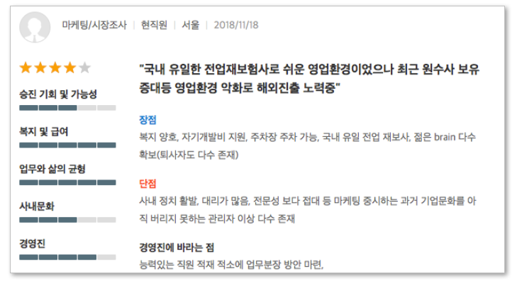
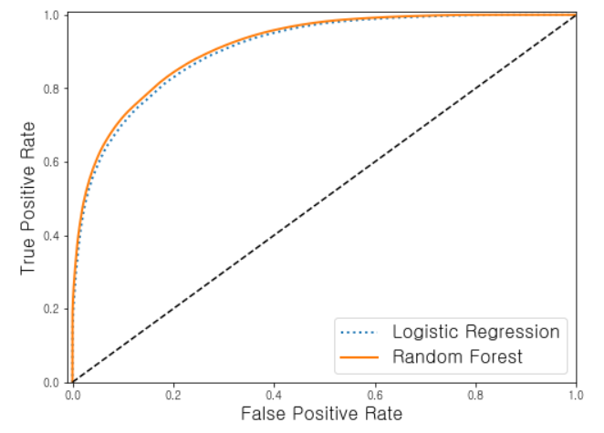
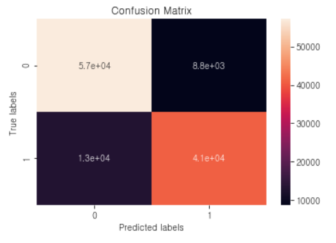
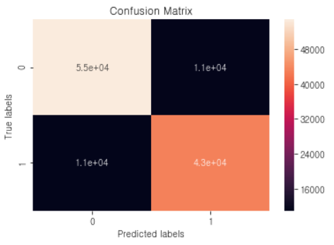
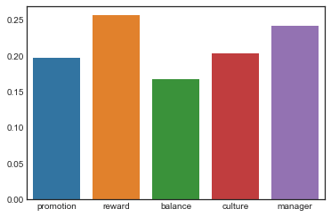
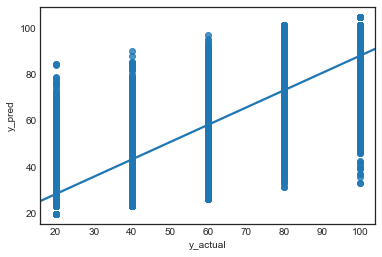
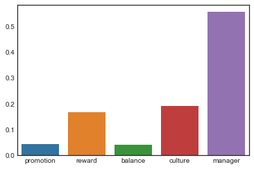
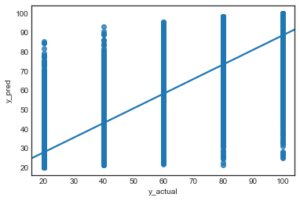

Final Project
=============

### - 기업 리뷰정보를 활용한 기업평가 보조지표 산출

---

### Goal

> -	기업별 주요 키워드 및 이슈 정보 추출
> -	인터넷의 기업 리뷰 정보를 활용한 기업 신용 평가 보조 지표 산출

### 진행상황

 

### 0. 산출물 링크

-	Text Representation  
	[특정 기업 샘플링 (1차)](sample_shc_190506.ipynb)  
	[2차원 T-SNE 시각화 (2차)](FinalProject_T-SNE.ipynb)  
	[Topic Model (2차)](FinalProject_LSA_TopicModel.ipynb)

	-	긍정/부정(LDA)  
		[(전체)긍정 키워드](FinalProject_LDA_GoodPoint.ipynb)  
		[(전체)부정 키워드](FinalProject_LDA_BadPoint.ipynb)  
		[(SHB)긍정 키워드](FinalProject_LDA_GoodPoint_SHB.ipynb)  
		[(SHB)부정 키워드](FinalProject_LDA_BadPoint_SHB.ipynb)

-	Classification  
	[별점기반 추천여부 분류](LogisticRegression.ipynb)

-	Regression  
	[별점평가 예측](tot_data_regression.ipynb)

-	Regression with Credit Scores in 2016  
	[2016년 별점평가+신용평가 점수 기반 예측](tot_data_regression_with_2016CreditScore.ipynb)

※ 만약 위의 링크가 github에서 로딩이 제대로 되지 않을 경우, github의 소스 URL을 복사하고 [nbviewer](https://nbviewer.jupyter.org)에서 열면 잘 보임

 

### 1. 데이터 수집

> -	[잡플래닛](https://www.jobplanet.co.kr/)에서 웹크롤링 : 563,922건
> -	R로 추출
> -	주요 항목
>
> 	-	회사이름, 회사코드, 리뷰코드, 직종구분, 재직상태, 근무지역, 등록일자
> 	-	(Numeric) 별점평가(총점), 승진기회, 복지급여, 워라밸, 사내문화, 경영진
> 	-	(Text) 기업장점, 기업단점, 바라는 점
> 	-	(Categorical) 성장예상여부, 추천여부
>
> 

 

### 2. 데이터 탐색

> 샘플링 : 초반에는 전체 데이터 추출에 시간이 걸렸으므로 전체 기업 정보를 추출 완료하기 전까지 특정 기업의 일부 데이터로 분석  
>  - 카드(143건), 은행(424건)

### 2.1 Preprocessing

-	Regression을 위한 전처리

	-	별점과 추천여부 간의 맥락이 맞지 않는 Abnormal한 건 삭제 (3,550건)

-	텍스트 분석을 위한 전처리

	-	값이 없는(np.nan) 내역을 삭제
	-	의미없는 단어 제거를 위해 불용어 stopwords 정의 

### 2.2 Text Data Representation

-	텍스트 데이터는 비정형 문자열로 되어 있으므로 이를 학습하기 위해서는 수치적 표현으로 바꿔줘야 한다.
-	Tokenization

	-	공백을 기준으로 분리 : 조사 등이 제대로 분리되지 않아서 동일한 뜻을 가진 단어들이 다 다른 특성으로 간주되어 불필요하게 반복됨
	-	형태소분석기를 통해 분리 : 공백을 토대로 분리하는 것보다는 성능이 낫지만, 다양한 한국어 표현을 다 반영하지는 못함. 여러 형태소분석기마다 성능이 조금씩 다르며, 여기서는 [KoNLPy](https://konlpy-ko.readthedocs.io/ko/v0.4.3/#) 패키지와 [Mecab](https://bitbucket.org/eunjeon/mecab-ko-dic/src/master/) 형태소분석기를 이용
		-	[한국어 형태소 분석기 비교글](https://iostream.tistory.com/144?fbclid=IwAR3FX3lo2njXmTPYyPdsBJhk_KdfRPVLjPcwH70wo31z-GSkNikzQUNyLm8)
		-	연산속도가 빠르다는 Mecab을 써도 형태소분석기로 분리하는 작업이 너무 오래 걸려서 별도의 pickle 파일로 저장하고 재사용

-	Vocabulary : 형태소분석기를 통해 138,001개의 단어 어휘 사전 생성

-	Document Vectorization : 문장 표현 방식

	(1) 단어의 빈도수에 기반하여 Vector화

	-	TDM(Term-Document Matrix)
	-	TF-IDF(Term Frequency-Inverse Document Frequency)

	&nbsp;&nbsp;&nbsp;&nbsp;&nbsp;&nbsp;&nbsp;※ document의 수 X Vocabulary의 수 크기의 sparse matrix를 생성

	(2) 문장 내 단어가 등장하는 연관 관계에 기반하여 Vector화

	-	Word2Vec (구현 예정)

-	Visualization : 모형 생성과는 무관하지만, 시각화된 텍스트를 통해 주요 키워드 파악이 용이함

	-	Count 기반의 Word Cloud
	-	Sparse Matrix(SciPy)를 2차원에 임베딩하여 T-SNE로 시각화  

 

### 3. 모형 생성 및 검증

> Text / Numeric 데이터(X)와 추천여부/별점평가(Y) 간 관계를 토대로 모형을 생성하고, 이를 기업이나 개인의 신용평가 모델로 활용할 수 있는 방안을 모색

### 3.1 Classification

-	6개 평가항목을 설명변수로 하여 추천/비추천 여부를 분류하는 모델 생성
-	데이터의 특징

	-	평가점수 생성기준 : 별 한 개가 20점(min) / 별 다섯 개가 100점(max)으로 별 한 개당 20점씩 가산됨
	-	추천여부 : 0 비추천 / 1 추천

-	데이터 샘플 예)

|   | 별점평가 | 승진기회 | 복지급여 | 워라밸 | 사내문화 | 경영진 | <u>추천여부</u> |
|---|---------:|---------:|---------:|-------:|---------:|-------:|----------------:|
| 0 |       80 |       80 |       80 |     60 |       60 |     80 |               1 |
| 1 |       80 |       60 |      100 |     80 |       80 |     80 |               1 |
| 2 |       20 |       20 |       40 |     20 |       20 |     20 |               0 |

-	모형은 [Logistic Regression, RandomForest] 두 가지 방식을 시도
-	전체의 70%를 training set, 30%를 test set으로 이용

-	검증 결과  
	(1) ROC Curve  
	

	Logistic Regression과 RandomForest가 유사한 성능을 보이지만, RF가 조금 더 나은 것으로 판단됨  (AUC Score LR: 0.9063266615887088, RF: 0.9136850898042395)

	(2) Confusion Matrix

	<u>Logistic Regression</u>  
	

	<u>RandomForest</u>  
	

Confusion Matrix를 비교해서 봤을 때에 Logistic Regression의 False Positive(오탐) 비율이 더 높게 나타남

### 3.2 Linear Regression

-	5개 평가항목을 설명변수로 하여 별점평가를 예측하는 모델 생성
-	데이터의 특징

	-	별점을 숫자로 환산한 데이터로, numerica data이나 discrete한 형태  

-	별점평가 예측에 있어 항목별 weight 확인 (coefficient, feature importance 이용)

-	모형은 [Linear Regression, RandomForest Regression] 두 가지 방식을 시도

-	검증 : R-Square값 산출하여 성능 평가

	<u>Linear Regression</u>  
	 

	<u>Random Forest</u>  
	 

두 가지 모델 모두 0.75 수준으로 어느 정도의 설명력을 보이는 것으로 판단됨

> < 성능 검증 방법 관련 >  
> - kappa : 우연히 예측해서 맞을 확률을 배제했을 때, 모델이 개선된 정도  
> - roc curve : recall과 specificity 고려 → FP를 줄이면서 TP를 높이는 모델을 우수하게 평가  
> - auc : roc curve 아래의 넓이  
> - f1-score : precsion과 recall의 조화 평균  
> - prc curve : precsion과 recall만 고려 → TN의 영향도는 무시하면서 TP를 높이는 모델을 우수하게 평가  
> - auprc : prc curve 아래의 넓이 (area under precsion-recall curve)

-	kaggle 검색시, 이상거래 탐지와 같은 higly unbalanced dataset에서 이상거래를 찾는 게 초점인 경우에 auprc를 성능평가 방법으로 쓰도록 나옴  
-	이론적으로 f1-score와 auprc는 비슷한 방향으로 움직이게 될 것으로 생각되나, f1-score의 경우 0,1 을 각각 타겟 value로 했을 때의 score를 평균을 내 이용하는 구조인 듯 하여 auprc와의 차이가 어떻게 발생하는지 확인 필요함

 

### 4. 향후 계획

### 4.1 비정형 데이터에 대한 Scoring (Topic/Sentiment Analysis)

-	1안_ 긍정/부정 리뷰별 키워드(Topic)를 도출하고 해당 키워드에 기반하여 문장을 Scoring
-	2안_ 전체 리뷰에서 많이 나온 단어들(Vocabulary)에 기반하여, 주요 단어들의 발현 빈도에 따라 Scoring

### 4.2 (내부 활용을 위한) 신용평가 대안/보조지표 산출

-	(4.1에서 도출한) Score와 실제 기업 신용등급 간의 상관성 탐색
	-	별점 관련 5개 독립변수 + 리뷰 데이터의 주요 키워드를 변수로 추가하여 모델 정교화
-	긍정, 부정 키워드 기반 alert 설계
	-	신용등급에 영향을 주는 항목에 대한 주요 키워드 산출하여 긍부정 signal 제공

 

### 5. 기타 이슈

### 5.1 내부 데이터와의 구체적인 연계 방안

-	내부 신용평가 데이터 샘플  

|   | 회사명 | 기준년월 | 대기업여부 | 상장구분 | 부도율 | 최종점수 | 최종등급 |
|---|-------:|---------:|-----------:|---------:|-------:|---------:|---------:|
| 0 | 아이린 |   201612 |          2 |        9 |  1.415 |     55.5 |        7 |
| 1 |   조이 |   201612 |          1 |        9 |  2.284 |     49.6 |        9 |
| 2 |   웬디 |   201612 |          1 |        9 |  0.120 |    75.01 |        3 |

-	문제점
	-	기준년월 과거 시점으로 현재 시점과 맞지 않음 : 과거 시점에 맞춰 크롤링한 feature를 붙여서 모델링 및 예측할 것인지, 아니면 이 데이터는 성능 검증을 위한 보조적 자료로 쓸 것인지 이 부분에 대하여 아직 미정

 
